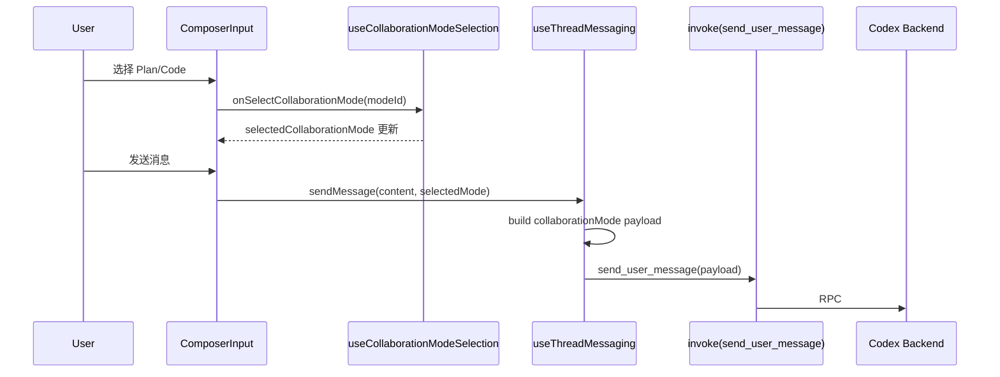
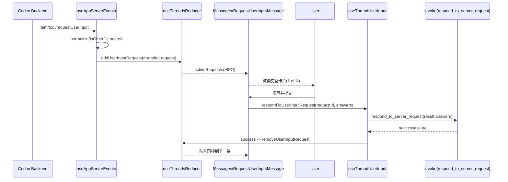
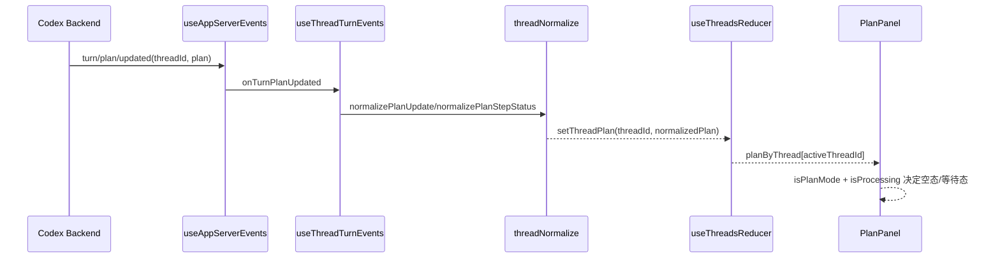
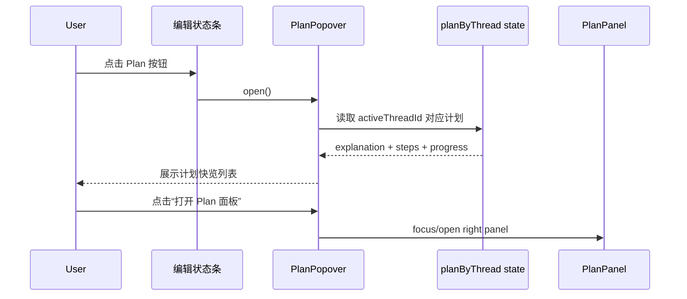
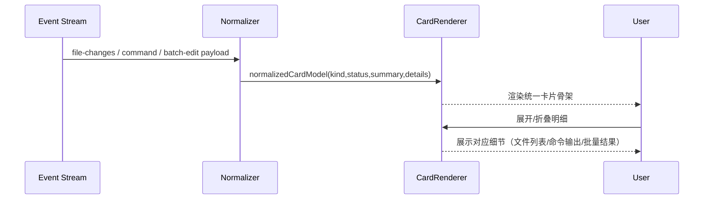
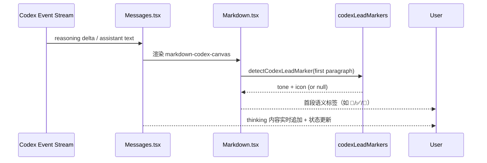

## Context

CodeMoss 已在 Codex 路径接入 `collaborationMode/list`、`turn/plan/updated`、`item/tool/requestUserInput`，并具备基础 UI
组件（协作模式选择、Plan 面板、用户输入卡片）。但当前主问题不在"协议缺失"，而在"幕布层表达不完整"：

- Plan/Code 切换默认受实验开关控制，入口常态不可见，用户误判为不支持。
- `askuserquestion`（工具展示名）与 `requestUserInput`（协议事件）语义割裂，用户难以建立映射。
- Plan 面板与 turn 事件虽已连通，但缺少"模式语义提示"和"等待/空态解释"，认知成本高。

约束与前提：

- 不改 Codex CLI 上游协议，仅在 CodeMoss 客户端收口。
- 仅作用于 Codex 引擎路径，Claude/OpenCode 路径行为保持不变。
- 保持现有 Tauri RPC 与事件管线，不新增后端外部依赖。

## 上游协议参考

本变更对齐的上游协议版本为 Codex CLI `0.101.0`（[openai/codex](https://github.com/openai/codex)）。关键协议定义：

**协作模式**（`codex-rs/protocol/src/config_types.rs`）：

- `ModeKind` 枚举：`Plan`、`Default`（alias: `code`/`pair_programming`/`execute`/`custom`）。
- TUI 仅暴露 `Default` + `Plan` 两种模式（`TUI_VISIBLE_COLLABORATION_MODES`）。
- `ModeKind::allows_request_user_input()` 只匹配 `Plan` 模式——即 `requestUserInput` 仅在 Plan 模式下由 AI 触发。

**用户提问协议**（`codex-rs/protocol/src/request_user_input.rs`）：

```rust
pub struct RequestUserInputQuestion {
    pub id: String,
    pub header: String,
    pub question: String,
    pub is_other: bool,     // serde: "isOther"
    pub is_secret: bool,    // serde: "isSecret" ← CodeMoss 当前未处理
    pub options: Option<Vec<RequestUserInputQuestionOption>>,
}
```

**计划步骤状态**（`codex-rs/protocol/src/plan_tool.rs`）：

```rust
pub enum StepStatus {
    Pending,      // serde: "pending"
    InProgress,   // serde: "in_progress"
    Completed,    // serde: "completed"
}
```

## Goals / Non-Goals

**Goals:**

- 在 Codex 对话幕布中提供稳定、可见、可操作的 Plan/Code 协作模式切换体验。
- 将 `requestUserInput` 交互链路做成可理解的 GUI 闭环（接收、回答、回传、队列可见）。
- 明确区分并文案对齐 `Plan mode` 与 `update_plan` 工具，减少错误预期。
- 保证 `turn/plan/updated` 的计划内容在当前线程内持续可见且状态准确。
- 补齐上游 `is_secret` 字段的前端处理，消除敏感信息泄露风险。

**Non-Goals:**

- 不新增模型路由策略、Provider 管理能力或多引擎统一壳层重构。
- 不改线程持久化模型与历史消息结构。
- 不进行大规模视觉重设计，只做幕布信息架构与交互优化。

## 现状代码锚点索引

### Capability 1: Collaboration Mode

| 关注点                | 文件                                                                  | 关键行号     | 现状                                                           |
|--------------------|---------------------------------------------------------------------|----------|--------------------------------------------------------------|
| hook: 获取 mode 列表   | `src/features/collaboration/hooks/useCollaborationModes.ts`         | L16-178  | 当 `enabled=false` 返回空数组，下游无法感知功能存在                           |
| hook: 构建发送 payload | `src/features/collaboration/hooks/useCollaborationModeSelection.ts` | L17-48   | 正常，payload 含 `mode` + `settings`                             |
| UI: 下拉渲染           | `src/features/composer/components/ComposerInput.tsx`                | L690-729 | `collaborationModes.length > 0` 为 false 时整个 `<select>` 不渲染   |
| 开关控制               | `src/App.tsx`                                                       | L557     | `enabled: appSettings.experimentalCollaborationModesEnabled` |
| 快捷键注册              | `src/features/app/hooks/useMenuAcceleratorController.ts`            | L74-78   | 开关关闭时 shortcut 为 `null`                                      |
| 快捷键行为              | `src/features/composer/hooks/useComposerShortcuts.ts`               | L93-109  | `collaborationModes.length > 0` 才生效                          |
| 发送链路               | `src/features/threads/hooks/useThreadMessaging.ts`                  | L503-517 | Codex 路径传 `collaborationMode`；Claude/OpenCode 路径不传           |
| Tauri IPC          | `src/services/tauri.ts`                                             | L265-285 | `invoke("send_user_message", payload)`                       |

### Capability 2: RequestUserInput

| 关注点           | 文件                                                        | 关键行号               | 现状                                                                  |
|---------------|-----------------------------------------------------------|--------------------|---------------------------------------------------------------------|
| 类型定义          | `src/types.ts`                                            | L239-271           | `RequestUserInputQuestion` 缺少 `isSecret` 字段                         |
| 事件接收+规范化      | `src/features/app/hooks/useAppServerEvents.ts`            | L117-155           | `isOther` 双兼容，`is_secret` 完全丢弃                                      |
| dispatch 分发   | `src/features/threads/hooks/useThreadUserInputEvents.ts`  | L1-17              | 直接 dispatch `addUserInputRequest`                                   |
| reducer 去重+队列 | `src/features/threads/hooks/useThreadsReducer.ts`         | L1418-1440         | `(workspace_id, request_id)` 去重，FIFO 追加                             |
| 卡片渲染          | `src/features/app/components/RequestUserInputMessage.tsx` | L28-200            | `activeRequests[0]` 只展示首个；全部用 `<textarea>` 无密码掩码                    |
| 消息流集成         | `src/features/messages/components/Messages.tsx`           | L668-675, L951-960 | `find()` 只取第一个匹配的 request                                           |
| 提交回传          | `src/features/threads/hooks/useThreadUserInput.ts`        | L11-29             | `respondToUserInputRequest` → `invoke("respond_to_server_request")` |
| Tauri IPC 定义  | `src/services/tauri.ts`                                   | L321-331           | payload: `{ workspaceId, requestId, result: { answers } }`          |
| Rust 后端       | `src-tauri/src/codex/mod.rs`                              | L685-706           | `respond_to_server_request` 支持 local + remote                       |

### Capability 3: Plan Visibility

| 关注点              | 文件                                                  | 关键行号             | 现状                                                                               |
|------------------|-----------------------------------------------------|------------------|----------------------------------------------------------------------------------|
| PlanPanel 组件     | `src/features/plan/components/PlanPanel.tsx`        | L3-58            | 58 行精简组件，空态仅 2 种文案                                                               |
| plan state       | `src/features/threads/hooks/useThreadsReducer.ts`   | L148, L1535-1550 | `planByThread[threadId]` 按线程隔离                                                   |
| 事件消费             | `src/features/app/hooks/useAppServerEvents.ts`      | L357-368         | `turn/plan/updated` → `onTurnPlanUpdated`                                        |
| 写入 state         | `src/features/threads/hooks/useThreadTurnEvents.ts` | L189-205         | `normalizePlanUpdate` → `setThreadPlan`                                          |
| 归一化逻辑            | `src/features/threads/utils/threadNormalize.ts`     | L171-213         | `normalizePlanStepStatus`: 支持 `pending`/`inProgress`/`completed`，未知值回退 `pending` |
| isProcessing 来源  | `src/App.tsx`                                       | L1500-1502       | `threadStatusById[activeThreadId]?.isProcessing`                                 |
| hasActivePlan 计算 | `src/App.tsx`                                       | L1490-1492       | `plan.steps.length > 0 \|\| plan.explanation`                                    |
| 面板折叠 CSS         | `src/features/layout/components/DesktopLayout.tsx`  | L166             | `plan-collapsed` class → `display:none`                                          |

### 工具名映射

| 关注点                  | 文件                                                                 | 关键行号     | 现状                                               |
|----------------------|--------------------------------------------------------------------|----------|--------------------------------------------------|
| `askuserquestion` 图标 | `src/features/messages/components/toolBlocks/GenericToolBlock.tsx` | L66      | `CODICON_MAP` 中有条目                               |
| `askuserquestion` 折叠 | 同上                                                                 | L72      | `COLLAPSIBLE_TOOLS` 中有条目                         |
| display name 映射表     | `src/features/messages/components/toolBlocks/toolConstants.ts`     | L61-116  | **无 `askuserquestion` 条目**，该工具名会 fallback 为原始名展示 |
| 渲染链路                 | `GenericToolBlock.tsx`                                             | L202-280 | `extractToolName` → `getToolDisplayName` → 渲染    |

## Decisions

### Decision 1: 采用"幕布层最小闭环"而非全量重构

- 选项 A：仅改文案提示。
    - 优点：改动最小。
    - 缺点：无法解决入口隐藏和交互流程断层。
- 选项 B（采用）：保持现有数据流，增强可见性与语义映射。
    - 优点：低风险、高收益、与当前代码结构兼容。
    - 缺点：需补充部分状态展示与回归测试。
- 选项 C：重构消息壳层与侧边布局。
    - 优点：体验统一。
    - 缺点：范围过大，回归成本高。

### Decision 2: 保持协议层不变，统一在 UI/事件消费层做语义映射

- 选项 A（采用）：保留协议事件 `item/tool/requestUserInput`，在工具日志层将 `askuserquestion` 归并解释为同一提问语义。
- 选项 B：新增后端桥接事件或重命名协议。

采用 A 的原因：

- 与 Codex CLI 0.101.0 协议完全对齐，避免自定义协议漂移。
- 不引入后端兼容负担，变更集中于前端语义层。

实施锚点：在 `toolConstants.ts` 的 `getToolDisplayNames` 和 `TOOL_DISPLAY_NAMES_FALLBACK` 中新增
`askuserquestion` → `"User Input Request"` / `"用户输入请求"` 映射条目。

### Decision 3: 协作模式入口遵循"显式可见 + 功能开关兼容"策略

- 选项 A（采用）：在 Codex 幕布始终显示当前协作模式状态；当实验开关关闭时显示不可交互态与引导提示。
- 选项 B：继续隐藏入口，完全依赖 settings 开关。

采用 A 的原因：

- 解决"功能存在但用户看不到"的核心问题。
- 兼容现有 `experimentalCollaborationModesEnabled` 开关，不引入行为突变。

实施锚点：修改 `ComposerInput.tsx:690` 的条件渲染——当 `activeEngine === "codex"` 时，即使
`collaborationModes.length === 0` 也显示 disabled 态 UI，并附带"Enable in Settings"引导。

### Decision 4: 计划可见性以 thread 维度状态为单一事实源

- 选项 A（采用）：继续以 `planByThread[threadId]` 为事实源，补空态/等待态解释文案与模式语义提示。
- 选项 B：新增独立 plan store 或冗余缓存。

采用 A 的原因：

- 减少状态分叉，复用现有 reducer 与测试资产。

实施锚点：`PlanPanel.tsx:31` 的 `emptyLabel` 三元表达式需要扩展为三态——新增 `isPlanMode` prop，区分
"Code 模式下无计划"vs"Plan 模式下等待中"vs"Plan 模式下空闲无计划"。

### Decision 5: `is_secret` 采用"默认掩码 + 可切换显示"策略

- 选项 A（采用）：`is_secret=true` 时 `<input type="password">` + 眼睛图标切换显示；日志和 debug 输出中脱敏。
- 选项 B：全掩码不可显示。
- 选项 C：不处理，维持现状。

采用 A 的原因：

- 上游 `RequestUserInputQuestion.is_secret` 已稳定定义（`bool`，默认 `false`），不处理是安全隐患。
- 全掩码（选项 B）不便于用户确认输入是否正确，降低可用性。
- 选项 C 直接排除——密码/Token 类输入以明文展示是不可接受的。

实施锚点：

1. `src/types.ts:L244` `RequestUserInputQuestion` 新增 `isSecret?: boolean` 字段。
2. `useAppServerEvents.ts:L139` 规范化逻辑新增 `isSecret: Boolean(question.isSecret ?? question.is_secret)` 行。
3. `RequestUserInputMessage.tsx` 渲染层：当 `isSecret=true` 时将 `<textarea>` 替换为 `<input type="password">`
   并增加可见性切换按钮。

### Decision 6: 协作模式开关关闭时允许快捷跳转 Settings

- 选项 A（采用）：disabled 态 collaboration mode 区域提供点击跳转至 Settings 实验功能区域。
- 选项 B：不允许跳转，仅文案引导。

采用 A 的原因：

- 用户已看到功能存在但不可用，提供一步到达的操作入口比纯文案提示转化率更高。
- `useMenuAcceleratorController.ts:L74-78` 中开关关闭时快捷键已为 `null`，UI 跳转不与快捷键冲突。

### Decision 7: Plan 面板空态必须区分三种语义

空态规则：

| 当前协作模式        | 线程处理状态 | Plan State | 显示文案                                          |
|---------------|--------|------------|-----------------------------------------------|
| Code（Default） | *      | 无          | "Switch to Plan mode to enable planning"      |
| Plan          | 处理中    | 无          | "Generating plan..."                          |
| Plan          | 空闲     | 无          | "No plan generated. Send a message to start." |

实施锚点：`PlanPanel.tsx` 需要新增 `isPlanMode: boolean` prop（来源于
`selectedCollaborationMode?.mode === "plan"`）。`App.tsx:L1500` 区域需要将 `selectedCollaborationMode`
作为 prop 传递给 `useLayoutNodes`。

### Decision 8: Plan 入口前置到编辑行并使用弹出列表

- 选项 A（采用）：在编辑状态条增加 `Plan` 按钮，点击打开轻量弹层（popover）展示当前线程计划摘要与步骤列表。
- 选项 B：仅保留右侧 Plan 面板入口，不新增前置触点。
- 选项 C：将完整 Plan 面板直接内嵌到编辑行。

采用 A 的原因：

- 用户在编辑态主要视线停留于“编辑 x/y 文件”行，前置入口降低认知切换成本。
- popover 比完整内嵌更轻量，不会破坏编辑区高度与现有布局稳定性。
- 继续保留右侧 Plan 面板，作为完整上下文查看位，形成“快览 + 详情”双层结构。

实施锚点：

1. 编辑状态条组件（`编辑 x/y 文件` 行）新增 `Plan` 触发按钮与计数徽标（如 `5/5`）。
2. 弹层内容复用计划数据源 `planByThread[activeThreadId]`，显示 `explanation`、步骤状态、完成进度。
3. 弹层中提供“打开右侧 Plan 面板”动作，保证深度查看路径一致。

### Decision 9: 执行卡片（File changes / 运行命令 / 批量编辑文件）采用统一视觉骨架

- 选项 A（采用）：三类卡片共用统一信息层级（标题栏、状态点、摘要行、明细区），通过轻量 token 区分语义色。
- 选项 B：每类卡片独立视觉语言，分别设计。
- 选项 C：维持现状，仅调字体与行高。

采用 A 的原因：

- 当前问题是“信息可读性断层”，核心在结构一致性而非单点样式。
- 共用骨架能显著降低维护成本，后续新增卡片类型可复用。
- 统一的失败态/警告态表达有利于用户快速扫描异常。

实施锚点：

1. `File changes`：新增“变更摘要条（+/-/文件数）+ 文件列表可折叠”。
2. `运行命令`：命令头与输出区分层，失败时默认展开错误块。
3. `批量编辑文件`：提供批量结果总览（成功/失败/跳过）+ 文件级 diff 入口。

### Decision 10: Codex 幕布首段语义采用“可配置关键词映射 + 智能命中评分”

- 选项 A（采用）：将“关键词 -> tone/icon”规则抽离为独立配置表，并提供智能评分（exact / startsWith / includes）。
- 选项 B：仅保留 `PLAN / 变更结果 / 已执行校验` 三个硬编码分支。
- 选项 C：完全手动在文案中写 emoji，不做自动识别。

采用 A 的原因：

- 新需求强调“不要局限于三个关键词”，必须支持扩展到 `下一步/风险/决策/总结` 等语义段落。
- 规则表 + 评分模型可在不改渲染流程的前提下持续扩词，维护成本显著低于分支堆叠。
- 通过组件入参暴露配置能力，后续可按业务线定制映射而不影响默认行为。

实施锚点：

1. 新增 `src/features/messages/constants/codexLeadMarkers.ts` 作为默认规则与匹配算法定义。
2. `Markdown.tsx` 改为调用 `detectCodexLeadMarker()`，并支持可选 `codexLeadMarkerConfig` 覆盖默认规则。
3. `messages.css` 为 `plan/result/verify/summary/risk/decision/next` 提供 tone class，统一视觉强化样式。

### Decision 11: 模型思考过程（reasoning）采用“增量流可见 + 状态可追踪”策略

- 选项 A（采用）：在 Codex 对话幕布中持续显示 reasoning 增量内容与状态（进行中/完成），并与最终回答按时间顺序同流呈现。
- 选项 B：仅在最终回答后显示摘要，不展示中间过程。
- 选项 C：仅保留顶部“思考中”文案，不展示 reasoning 内容体。

采用 A 的原因：

- 用户明确反馈“思考过程不可见”，属于核心可解释性缺口。
- 增量可见可降低“卡住/无响应”感知，提升长任务期间的信任与可控性。
- 仅在 Codex 门控下生效，能避免对 Claude/OpenCode 现有信息密度造成干扰。

实施锚点：

1. `Messages.tsx` 以 reasoning item 为实时渲染源，标题用于活动条，正文保持按块增量刷新。
2. 保证 reasoning 与 assistant message 的时间顺序一致，不因补帧导致“思考后置”或“思考消失”。
3. 为流式回放补组件/集成测试，覆盖“仅标题”“标题+正文”“中途更新”“完成收口”四类场景。

## Risks / Trade-offs

- [风险] 协作模式入口显式化后，用户可能误以为所有模式立即可用。
  → Mitigation: 开关关闭时展示只读状态与"到设置启用"引导，不允许 silent fail。

- [风险] `askuserquestion` 与 `requestUserInput` 双语义并存导致文案冲突。
  → Mitigation: 统一在工具展示层输出标准术语"User Input Request"，并保留别名说明。

- [风险] Codex 专属改动误影响 Claude/OpenCode。
  → Mitigation: 所有渲染与交互入口按 `activeEngine === "codex"` 门控，并补跨引擎回归用例。

- [风险] `requestUserInput` 新字段（如 `is_secret`）处理不当造成信息泄露。
  → Mitigation: `is_secret=true` 时强制 `<input type="password">`，日志层过滤明文，`console.log` / debug
  输出中对 `isSecret` 字段值做 `"***"` 替换。

- [风险] Plan 面板折叠态下新增的引导文案中若含交互元素（如按钮），会被 `display:none` 隐藏但仍可能被
  tab 键聚焦。
  → Mitigation: 折叠态下的交互元素加 `tabIndex={-1}` 和 `aria-hidden="true"`。

- [风险] Code 模式下 AI 仍可能通过 tool call 日志显示 `askuserquestion` 名称，但因
  `ModeKind::allows_request_user_input()` 限制不会触发真实的 `requestUserInput` 事件，用户可能困惑。
  → Mitigation: 在 `GenericToolBlock.tsx` 的 `askuserquestion` 渲染中，当 `activeCollaborationMode !== "plan"`
  时追加一条 hint："This feature requires Plan mode"。

- [风险] 执行卡片视觉重构引入布局跳变，影响历史消息阅读连续性。
  → Mitigation: 保持卡片外边距与消息节奏不变，仅重构卡片内部层级；增加截图回归基线。

- [风险] 运行命令输出高亮策略不当导致误导（把普通日志误标红）。
  → Mitigation: 只对明确失败模式（exit code / ERROR / stack trace）启用强调，其他保持中性。

- [风险] 关键词智能映射命中错误，导致段落 tone/icon 误判。
  → Mitigation: 采用评分阈值 + 可配置规则；低置信度不强化；补“误命中”回归用例。

- [风险] reasoning 流式内容刷新频繁，引发重排抖动或输入卡顿。
  → Mitigation: 复用现有 markdown 节流渲染机制（80ms flush），并在 Codex 路径限定增强逻辑。

## Migration Plan

1. 先补 specs 与 tasks，锁定 capability 契约和验收边界。
2. 实施阶段按"语义映射 → is_secret 补齐 → 入口可见性 → 提问闭环 → Plan 空态 → 回归测试"顺序推进。
3. 灰度验证：先在 Codex 路径验证功能，再执行全量回归。
4. 回滚策略：所有改动均为前端可控逻辑，必要时按 feature flag 或组件级 revert 回退；不涉及数据迁移。

## 关键时序（Sequence）

### Sequence A: 协作模式切换与发送一致性



约束：

- `activeEngine !== "codex"` 时不得传 `collaborationMode`。
- 快速切换（Plan→Code→Plan）后，发送必须以最终选中值为准。

### Sequence B: requestUserInput 接收-回答-回传闭环



约束：

- `(workspace_id, request_id)` 去重，防止重复入队。
- `isSecret=true` 默认密码输入；日志统一脱敏为 `"***"`。

### Sequence C: turn/plan/updated 到 Plan 面板可见



约束：

- 同线程新计划覆盖旧计划（replace，不 merge）。
- 跨线程严格隔离，切线程即切计划视图。

### Sequence D: 编辑行 Plan 按钮快览



约束：

- 快览内容必须与右侧 Plan 面板同源，不允许双份状态。
- 无计划时弹层展示与面板一致的空态语义，不显示陈旧缓存。

### Sequence E: 执行卡片统一渲染



约束：

- `kind` 决定语义图标与补充字段，不改变骨架结构。
- 同一条消息内多卡片必须保持垂直节奏一致（间距、标题、状态位）。

### Sequence F: Codex thinking 流与首段语义强化



约束：

- 仅 `activeEngine === "codex"` 时启用首段语义强化与 reasoning 流增强。
- 未命中规则时保持原文渲染，不得强行插入图标。
- 流式过程中保持输入区可用性，不得因高频 re-render 阻塞交互。

## 异常分支与处理策略

| 异常场景            | 触发点                                           | 用户可见行为         | 系统处理                                  |
|-----------------|-----------------------------------------------|----------------|---------------------------------------|
| 协作模式开关关闭        | `experimentalCollaborationModesEnabled=false` | 入口可见但禁用，显示启用引导 | 不渲染可交互选择；快捷键置 `null`                  |
| request 提交失败    | `respond_to_server_request` 报错                | 显示失败提示，可重试     | 请求保留在队列头，不自动出队                        |
| 收到重复 request    | 同 `(workspace_id, request_id)` 重复事件           | 不出现重复卡片        | reducer 去重，保持原队列顺序                    |
| step status 非法值 | `unknown/null/""` 等                           | 仍可渲染计划         | 状态回退 `pending`，进度摘要按归一化状态计算           |
| 非 Codex 引擎误显示   | 引擎切换后残留 UI                                    | 不应出现协作模式 UI    | 全链路 `activeEngine==="codex"` 门控，切换时清理 |
| 敏感字段泄露风险        | `isSecret=true` 的输入与日志                        | 输入默认掩码         | UI 用 password 控件；日志输出统一脱敏             |

## Resolved Questions

### Q1: `is_secret` 的最终 UX

**决策**：默认掩码 + 可切换显示。`<input type="password">` + 眼睛图标切换。日志和 debug 输出中脱敏为 `"***"`。
理由见 Decision 5。

### Q2: 协作模式入口在开关关闭时是否允许快捷跳转 Settings

**决策**：允许。disabled 态点击直接跳转到 Settings 的实验功能区域。
理由见 Decision 6。

### Q3: Plan 面板空态文案是否需要区分

**决策**：必须区分三种语义——Code 模式无计划、Plan 模式等待中、Plan 模式空闲无计划。
理由见 Decision 7。
